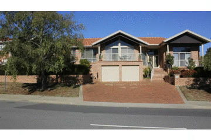
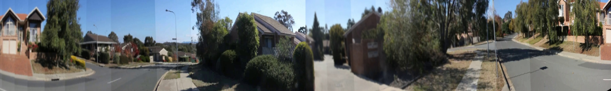

## Panoramic Photo Generation from Video ##

Project for ANU ENGN4528/6528 (Computer Vision), Semester 1. May 21, 2018.

See the project report [here](Panoramic-Photo-Generation.pdf).

Besides, there are 4 mini projects in this course which can be found [here](https://github.com/ybhan/Computer-Vision-Projects).

### Approach

- Key frame selection
- SIFT (Scale Invariant Feature Transform) Matching
- RANSAC (Random Sample Consens)
- Cylindrical Projection
- Image Blending (Linear, Laplacian)
- Image Cropping

### Experiment Environment ###

- Python 3.6.3
	- numpy 1.14.3
	- OpenCV 3.4.0.12
	- OpenCV-contrib 3.4.0.12

Note that **OpenCV and OpenCV-contrib must be lower than (not including) 3.4.3**. Because SIFT is a patented algorithm and has been excluded after 3.4.3 (see [Issue: Include non-free algorithms](https://github.com/skvark/opencv-python/issues/126)). Installing an old version (up to 3.4.2) can solve this problem. For example, with pip:
```shell
$ pip install opencv-python==3.4.2.17
$ pip install opencv-contrib-python==3.4.2.17
```

### Data ###

*360video.mp4*: Scenery near ANU campus, taken from a smart phone camera.


Outcome:



### Codes ###

- `cap_key_frames.py`
- `generate_pano.py`
- `stitch.py`
- `append_operation.py`

### Usage ###

Run `python3 cap_key_frames.py 'file'` to extract key frames of the video file. Replace 'file' with the video file path. If not given, the default value is '360video.mp4'. The captured frames are stored in *key_frames/*. The stride parameter for accelerating the process can be adjusted in line 27.

Run `python3 generate_pano.py 'num'` to stitch the frames in *key_frames/* successively (including cylindrical projection, blending and cropping). This will generate an image called *panoramic.jpg*, which is the outcome. Replace 'num' with the number of frames to be stitched. If not given, the default value is 23.
